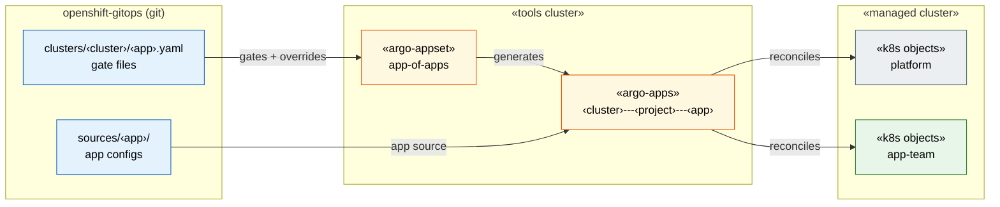

# openshift-gitops

Source of truth for OpenShift GitOps — driving Argo CD, RHACM, and related tooling
across all clusters via a strict, schema-validated directory structure.

## How it works



A single ApplicationSet in [`sources/app-of-apps`](sources/app-of-apps/) generates
every Argo CD Application. Apps are **defined** in `sources/<app-name>/` and
**deployed to clusters** by touching a gate file at
`clusters/<cluster-name>/<app-name>.yaml`. The gate file may be empty (`{}`) to
accept all org defaults, or may contain any Argo CD Application field overrides.

→ **[Full architecture diagrams](docs/diagrams/README.md)**

The same `sources/<app>` path is consumed by Argo CD for steady-state reconciliation,
by Ansible and RHACM for cluster bootstrapping, and by any future delivery tool —
there is no separate bootstrap copy of configs. See
[ADR-0001](docs/adr/0001-sources-by-app.md).

## Application naming

All Applications use the pattern `<clusterName>---<projectName>---<appName>`.

`clusterName` is the Argo CD cluster secret / RHACM ManagedCluster name.
`projectName` is the Argo CD AppProject (the stable authorization boundary).
`appName` matches the `sources/<app-name>` directory name.
See [ADR-0002](docs/adr/0002-application-naming-convention.md).

## Directory structure

```
clusters/             Per-cluster gate files and overrides
  <cluster-name>/     One directory per cluster
    <app-name>.yaml   Gate file: deploys the app; content overrides defaults
    app-of-apps/      Kustomize overlay: injects cluster list + cluster secret
sources/              Argo CD Application sources, one per app
  app-of-apps/        ApplicationSet — the flywheel
  app-projects/       AppProject Helm chart and per-team values files
profiles/             Organizational profiles (teams, cluster-types, data-centers)
  teams/<team>/       Team AppProject values and team-specific config
  cluster-types/      Cluster-type app compositions and app-groups
  data-centers/       Infrastructure-specific overrides per DC
docs/adr/             Architecture Decision Records
```

## Adding an application

1. Create `sources/<app-name>/` with valid Argo CD source content (plain manifests,
   Kustomize, or Helm).
2. Add `clusters/<cluster>/<app-name>.yaml` — an empty `{}` deploys with all org
   defaults. Add any Argo CD Application field overrides as needed.
   *No gate file = app is not deployed to that cluster.*
3. The ApplicationSet picks it up on the next sync — no other changes required.

## Adding a team / AppProject

1. Create `profiles/teams/<team>/appproject.yaml` with the team's project definition
   (and the active delivery copy at `sources/app-projects/<team>.yaml` until
   multi-source is adopted).
2. Add the filename to `spec.source.helm.valueFiles` in
   `clusters/<cluster>/app-projects.yaml`.

## Bootstrap a new cluster

```bash
# See ADR-0005 for the full bootstrapping sequence
kubectl apply -k clusters/<cluster-name>/app-of-apps/
```
