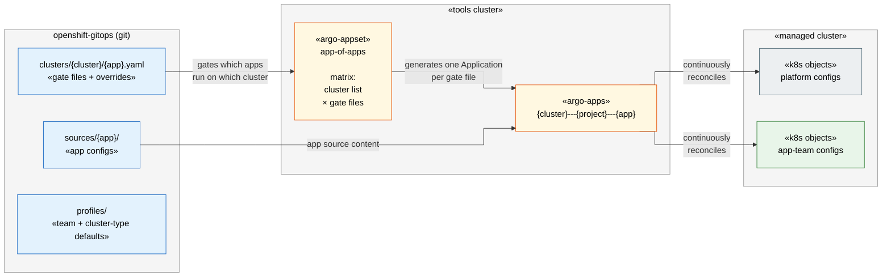

# The Flywheel

> **Zoom level:** Conceptual — one idea per box.
> **Next:** [Cluster Architecture →](02-cluster-architecture.md)

The simplest statement of the architecture: git is the source of truth; the
ApplicationSet is the engine that turns git state into running Kubernetes objects;
the flywheel spins continuously, reconciling drift back to desired state.

## Key properties

- **Gate file present + empty** → app runs with all org defaults.
- **Gate file present + overrides** → org defaults merged with per-cluster overrides.
- **Gate file absent** → app does not run on that cluster.
- **Drift** → Argo CD detects and reconciles back to git state within minutes.
- **Self-managing** → the ApplicationSet is itself an Argo CD Application, so
  changes to the ApplicationSet are also reconciled from git (see [Bootstrap →](06-bootstrap.md)).
