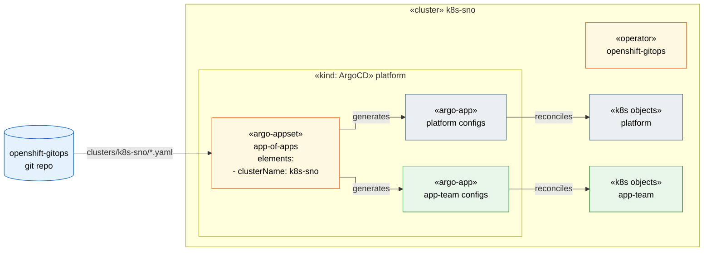
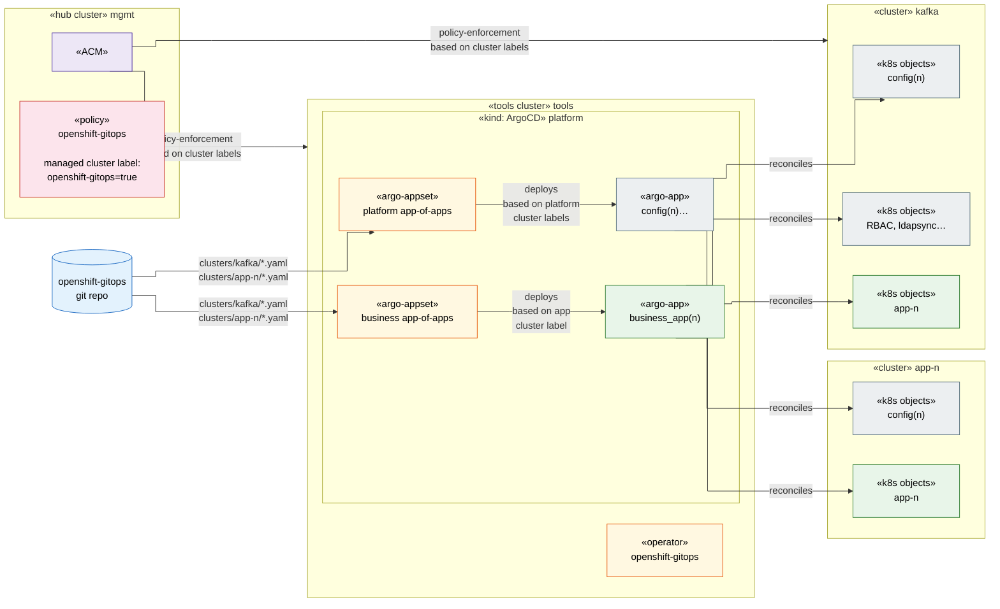
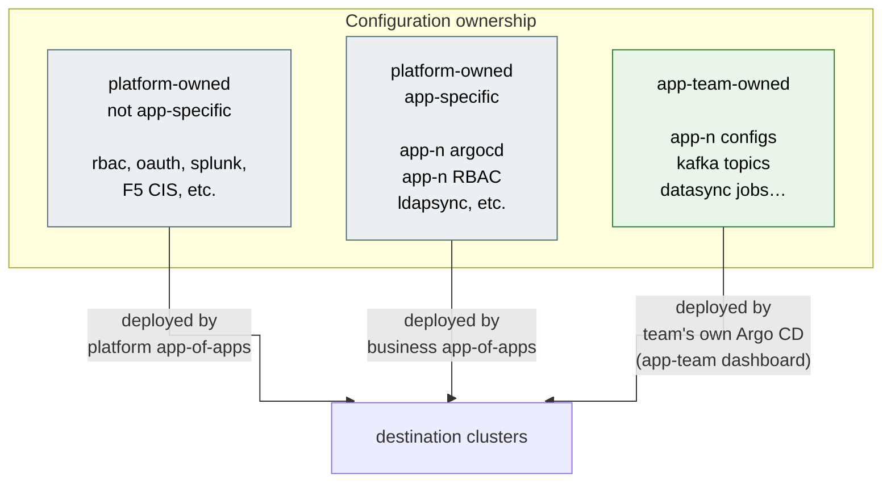

# Cluster Architecture

> **Zoom level:** Infrastructure — clusters, Argo CD instances, ACM hub.
> **Previous:** [← The Flywheel](01-flywheel.md) | **Next:** [App-of-Apps Internals →](03-app-of-apps.md)

Two deployment models are supported. Per-cluster is the default; hub is the
enterprise scale-out pattern. The git repo structure and Application naming
convention are identical in both — switching is a generator config change, not a
repo restructure (ADR-0002, ADR-0004).

---

## Model A — Per-cluster Argo CD (default)

Each cluster runs its own Argo CD instance, managing only itself.
The cluster list in the ApplicationSet has exactly one entry.

---

## Model B — Hub Argo CD (enterprise / multi-cluster)

One Argo CD instance on the hub/tools cluster manages all spoke clusters.
ACM enforces the openshift-gitops operator on managed clusters via policy.
The cluster list in the ApplicationSet has one entry per managed cluster.

This model corresponds to the architecture in the original PDF diagrams.

### Ownership breakdown (hub model)

---

## Migration path: per-cluster → hub

The git repo requires **no structural changes**. The migration steps are:

1. Deploy hub Argo CD instance on the tools cluster.
2. Add managed cluster secrets to hub Argo CD (`clusters/<cluster>/app-of-apps/cluster-secret.yaml`).
3. Update the ApplicationSet `elements:` list to include all managed clusters.
4. Remove per-cluster Argo CD instances (optional, can coexist during transition).

Application names change from `k8s-sno---platform---app` to
`k8s-sno---platform---app` — identical, because the naming convention always
includes `clusterName` (ADR-0002, ADR-0004).
