# Configuration Cascade

> **Zoom level:** Values — how defaults resolve through layers.
> **Previous:** [← App-of-Apps Internals](03-app-of-apps.md) | **Next:** [Ownership Model →](05-ownership.md)
> **ADR:** [ADR-0003 — Organizational defaults over boilerplate](../adr/0003-organizational-defaults-over-boilerplate.md)

Configuration resolves through layers, like CSS cascade. Higher layers win;
a missing value falls through to the layer below. Only write what genuinely
deviates from the layer beneath you.

```mermaid
%%{init: {'flowchart': {'curve': 'step', 'padding': 20}}}%%
flowchart TB
    classDef git      fill:#e3f2fd,stroke:#1565c0,color:#000
    classDef argo     fill:#fff8e1,stroke:#e65100,color:#000
    classDef platform fill:#eceff1,stroke:#546e7a,color:#000
    classDef appteam  fill:#e8f5e9,stroke:#2e7d32,color:#000
    classDef k8s      fill:#f5f5f5,stroke:#9e9e9e,color:#000

    K8S["Layer 1 — Kubernetes / Argo CD defaults\n\nrestartPolicy, resource defaults, ArgoCD Application defaults\n(outside this repo's scope — Kubernetes owns these)"]:::k8s

    ORG["Layer 2 — Org defaults\nsources/app-of-apps/applicationset.yaml template\nsources/app-projects/chart/values.yaml\n\nExamples:\n  syncPolicy: automated + prune + selfHeal\n  destination.namespace: openshift-gitops\n  project: platform\n  AppProject RBAC structure: 3 roles per team"]:::argo

    PROFILE["Layer 3 — Profile overrides\nprofiles/teams/{team}/\nprofiles/cluster-types/{type}/\nprofiles/data-centers/{dc}/\n\nExamples:\n  team AppProject destinations restricted to own namespaces\n  cluster-type adds specific app-group\n  data-center sets storage class name"]:::platform

    GATE["Layer 4 — Per-cluster-per-app gate file\nclusters/{cluster}/{app}.yaml\n\nExamples:\n  source.targetRevision: feature/my-branch\n  source.repoURL: https://github.com/my-team/apps.git\n  syncPolicy.automated: null  (disable auto-sync for prod)"]:::appteam

    K8S     -->|"base defaults\n(implicit)"| ORG
    ORG     -->|"org defaults\n(explicit, one place)"| PROFILE
    PROFILE -->|"profile overrides\n(per team / type / dc)"| GATE
    GATE    -->|"final resolved\nApplication spec"| RESULT["«argo-app»\nk8s-sno---platform---my-app\n\nfully resolved Configuration"]:::argo
```



## What each layer owns

| Layer | Owns | Does NOT own |
|---|---|---|
| **Kubernetes** | Pod spec defaults, K8s API behavior | Org policy |
| **Org defaults** | Sync policy, naming, RBAC template, default destination, default project | Per-team customization |
| **Profile** | Team RBAC specifics, cluster-type app set, DC infrastructure vars | Individual app overrides |
| **Gate file** | Per-cluster-per-app deviations, revision pinning | Everything a higher layer already covers |

## Practical examples

```
Q: What namespace does my-app deploy to?
A: Check gate file → profile → org default (openshift-gitops).

Q: What AppProject does my-app belong to?
A: Check gate file (spec.project) → org default (platform).

Q: Which clusters run my-app?
A: Any cluster with clusters/<cluster>/my-app.yaml present.
```
