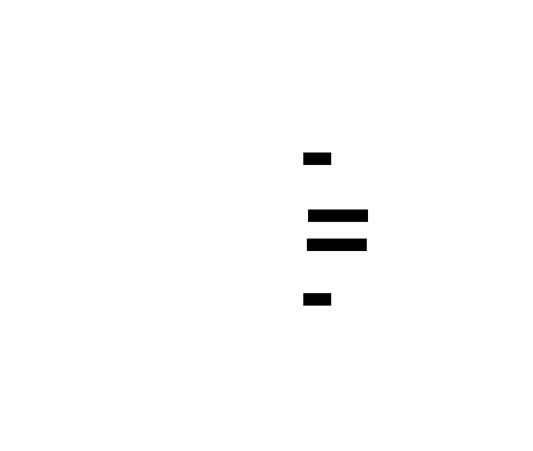

# Ownership Model

> **Zoom level:** Authorization — who owns what, AppProjects, RBAC.
> **Previous:** [← Configuration Cascade](04-configuration-cascade.md) | **Next:** [Bootstrap Sequence →](06-bootstrap.md)
> **ADR:** [ADR-0003](../adr/0003-organizational-defaults-over-boilerplate.md)

Every Argo CD Application belongs to an AppProject. Every AppProject is owned by
one or more teams. Teams source from LDAP groups and map to OpenShift RBAC roles.


> Source: [`src/05a-ownership.d2`](src/05a-ownership.d2) — render with `make` in this directory.

## AppProject source: profiles/teams/

Each team's AppProject is defined as a Helm values file consumed by `sources/app-projects/chart/`.
The chart encodes the RBAC template (3 roles per team); the values file provides
only team-specific data.



> Source: [`src/05b-appproject-source.d2`](src/05b-appproject-source.d2) — render with `make` in this directory.

## Shared AppProjects (multi-team ownership)

An AppProject may be co-owned by listing multiple teams in the `teams:` array.
The chart generates one set of roles per team entry. Shared projects are defined
in the primary owning team's profile directory by convention.

```yaml
# profiles/teams/platform/shared-infra-appproject.yaml
projects:
  - name: shared-infra
    description: "Shared infrastructure — jointly owned by platform and network teams"
    teams:
      - name: platform
        adminsGroup: platform-admins
        developersGroup: platform-developers
        viewersGroup: platform-viewers
      - name: network
        adminsGroup: network-admins
        developersGroup: network-developers
        viewersGroup: network-viewers
```
