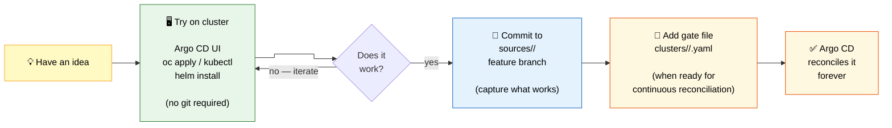
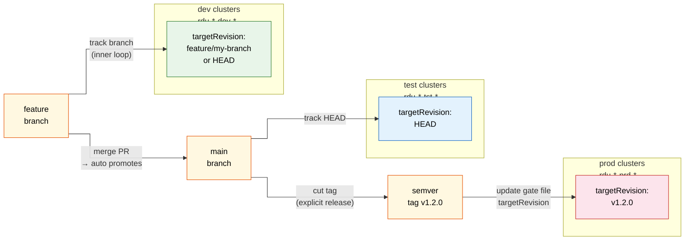

# Development Workflow

> **Zoom level:** Process — inner loop and environment promotion.
> **Previous:** [← Bootstrap Sequence](06-bootstrap.md)
> **ADR:** [ADR-0006 — Development workflow and environment promotion](../adr/0006-development-workflow-and-environment-promotion.md)

## Inner development loop

The loop is intentionally cluster-first. Git operations enter only when a
configuration is proven and worth keeping.



## Environment promotion

Each environment has a different relationship to git history. Promotion is always
a deliberate upward step — never automatic from dev to prod.



## Changing targetRevision

Any Application's `targetRevision` can be changed in three ways:

| Method | Scope | Persists across sync? |
|---|---|---|
| Gate file override | This app on this cluster | Yes (committed to git) |
| Argo CD UI override | This app instance | Yes — `ignoreApplicationDifferences` preserves it |
| Kustomize patch on `app-of-apps` | All apps on this cluster | Yes (committed to git) |

## Team-controlled repos

A team that wants full control of their revision can point a gate file at their
own git repo. They inherit all org defaults (project, sync policy, destination)
and only override the source:

```yaml
# clusters/rdu-sno-dev-1/my-team-apps.yaml
spec:
  source:
    repoURL: https://github.com/my-team/apps.git
    targetRevision: HEAD
    path: sources/my-team-apps
```

This is a first-class supported pattern — see ADR-0006.
