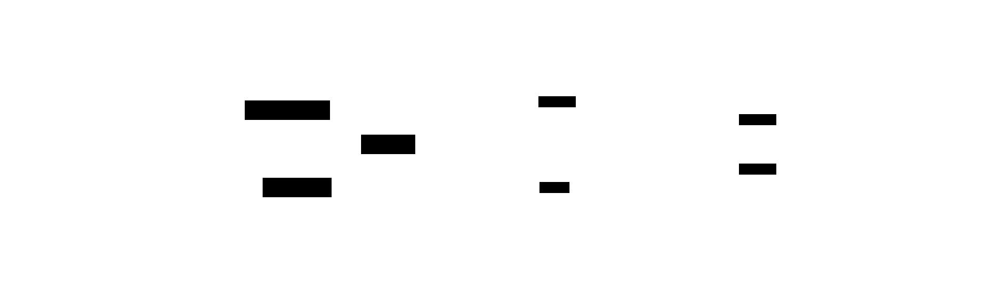
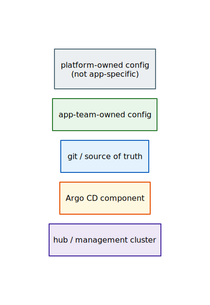

# Architecture Diagrams

Spatial index of all architecture diagrams. Start here for orientation, then
follow links to zoom into any area. Each diagram covers one concept at one zoom
level — together they form the full architecture picture.

## Navigation map

The diagram below is the "infinite canvas" entry point. Each region links to a
detail diagram. Read left-to-right: git is the source of truth, Argo CD is the
engine, managed clusters are the output.

> Source: [`src/00-navigation-map.d2`](src/00-navigation-map.d2) — render with `make` in this directory.

## Diagram index

| # | Diagram | Covers | Used in |
|---|---|---|---|
| [01](01-flywheel.md) | **The Flywheel** | Core concept: git → Argo CD → clusters | `README.md` |
| [02](02-cluster-architecture.md) | **Cluster Architecture** | Hub + per-cluster models, ACM policy enforcement | ADR-0004, ADR-0005 |
| [03](03-app-of-apps.md) | **App-of-Apps Internals** | ApplicationSet matrix, gate files, templatePatch | ADR-0003, `sources/app-of-apps/` |
| [04](04-configuration-cascade.md) | **Configuration Cascade** | 4-layer default resolution | ADR-0003 |
| [05](05-ownership.md) | **Ownership Model** | Platform vs app-team, AppProjects, profiles | ADR-0003, `profiles/` |
| [06](06-bootstrap.md) | **Bootstrap Sequence** | First-time cluster setup, self-reference seams | ADR-0005 |
| [07](07-dev-workflow.md) | **Development Workflow** | Inner loop, git promotion, environments | ADR-0006 |

## Conventions

**Color coding** — consistent across all diagrams, matching the original PDF:

> Source: [`src/00-color-legend.d2`](src/00-color-legend.d2) — render with `make` in this directory.

**Stereotypes** use UML guillemet notation (`«kind»`, `«argo-appset»`, etc.) to
indicate the Kubernetes resource kind or architectural role.

**Zoom levels** follow the spatial metaphor established by the PDF diagrams:

- Clusters are depicted as 3D boxes (described in text, approximated with subgraphs)
- Left → right: source of truth → engine → destination
- Top → bottom: hub/management → platform → app-team
