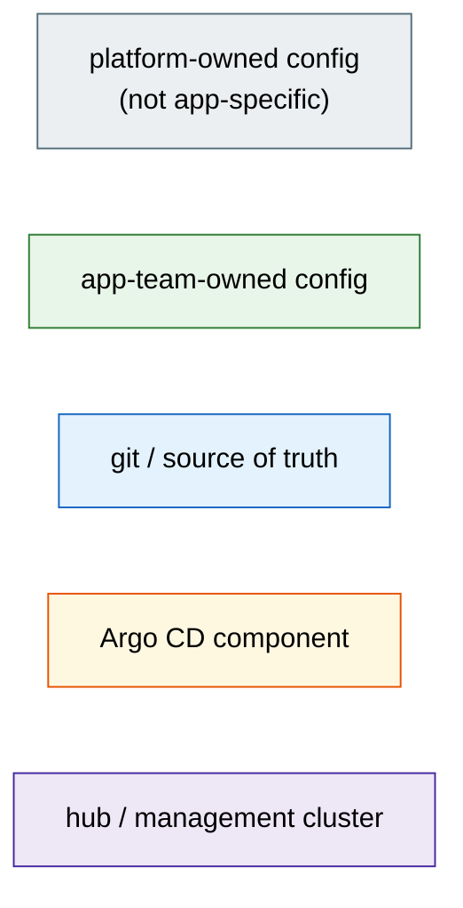

# Architecture Diagrams

Spatial index of all architecture diagrams. Start here for orientation, then
follow links to zoom into any area. Each diagram covers one concept at one zoom
level — together they form the full architecture picture.

## Navigation map

The diagram below is the "infinite canvas" entry point. Each region links to a
detail diagram. Read left-to-right: git is the source of truth, Argo CD is the
engine, managed clusters are the output.

```mermaid
flowchart LR
    classDef git     fill:#e3f2fd,stroke:#1565c0,color:#000
    classDef argo    fill:#fff8e1,stroke:#e65100,color:#000
    classDef cluster fill:#f5f5f5,stroke:#757575,color:#000
    classDef profile fill:#f3e5f5,stroke:#6a1b9a,color:#000
    classDef link    fill:#fff,stroke:#bbb,color:#1565c0

    subgraph SRC["Source of truth"]
        GIT["📁 git repo\nopenshift-gitops"]:::git
        PROFILES["📂 profiles/\nteams · cluster-types\ndata-centers"]:::profile
    end

    subgraph ENGINE["Argo CD engine (per-cluster or hub)"]
        APPSET["⚙️ app-of-apps\nApplicationSet"]:::argo
        APPS["📦 Argo CD\nApplications"]:::argo
        APPPROJ["🔐 AppProjects\n& RBAC"]:::argo
    end

    subgraph CLUSTERS["Managed clusters"]
        C1["🖥️ rdu-sno-dev-1"]:::cluster
        CN["🖥️ rdu-app-prd-1\n…"]:::cluster
    end

    GIT -->|"gate files\nclusters/<cluster>/*.yaml"| APPSET
    GIT -->|"app sources\nsources/<app>/"| APPS
    PROFILES -->|"team + cluster-type\ndefaults"| APPPROJ
    APPSET -->|generates| APPS
    APPPROJ -->|governs| APPS
    APPS -->|reconciles| C1
    APPS -->|reconciles| CN

    click GIT      "../../README.md"                        "Repo overview"
    click APPSET   "03-app-of-apps.md"                     "App-of-apps internals"
    click APPS     "03-app-of-apps.md"                     "App-of-apps internals"
    click APPPROJ  "05-ownership.md"                       "Ownership & RBAC"
    click PROFILES "05-ownership.md"                       "Ownership & RBAC"
    click C1       "02-cluster-architecture.md"            "Cluster architecture"
    click CN       "02-cluster-architecture.md"            "Cluster architecture"
```

## Diagram index

| # | Diagram | Covers | Used in |
|---|---|---|---|
| [01](01-flywheel.md) | **The Flywheel** | Core concept: git → Argo CD → clusters | `README.md` |
| [02](02-cluster-architecture.md) | **Cluster Architecture** | Hub + per-cluster models, ACM policy enforcement | ADR-0004, ADR-0005 |
| [03](03-app-of-apps.md) | **App-of-Apps Internals** | ApplicationSet matrix, gate files, templatePatch | ADR-0003, `sources/app-of-apps/` |
| [04](04-configuration-cascade.md) | **Configuration Cascade** | 4-layer default resolution | ADR-0003 |
| [05](05-ownership.md) | **Ownership Model** | Platform vs app-team, AppProjects, profiles | ADR-0003, `profiles/` |
| [06](06-bootstrap.md) | **Bootstrap Sequence** | First-time cluster setup, self-reference seams | ADR-0005 |
| [07](07-dev-workflow.md) | **Development Workflow** | Inner loop, git promotion, environments | ADR-0006 |

## Conventions

**Color coding** — consistent across all diagrams, matching the original PDF:



**Stereotypes** use UML guillemet notation (`«kind»`, `«argo-appset»`, etc.) to
indicate the Kubernetes resource kind or architectural role.

**Zoom levels** follow the spatial metaphor established by the PDF diagrams:
- Clusters are depicted as 3D boxes (described in text, approximated with subgraphs)
- Left → right: source of truth → engine → destination
- Top → bottom: hub/management → platform → app-team
